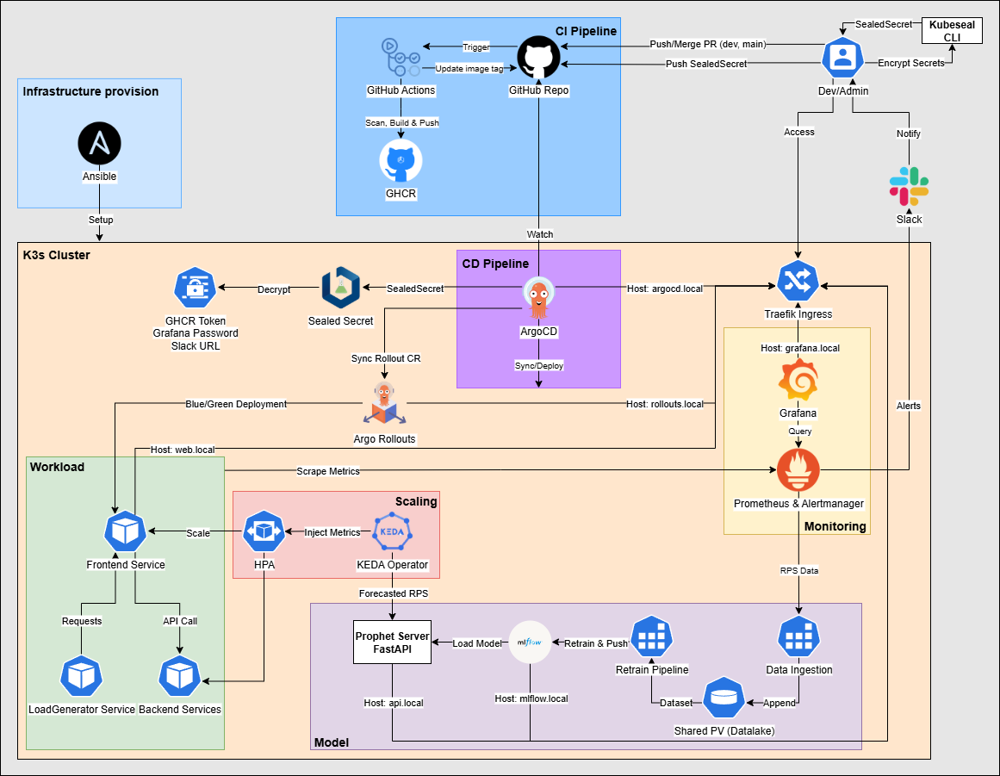
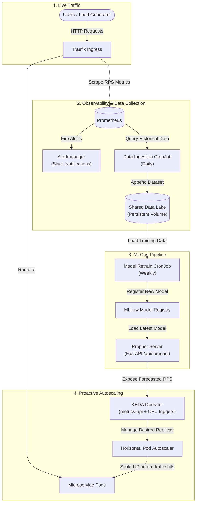
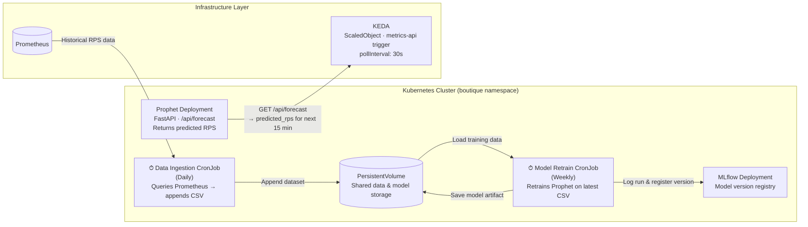
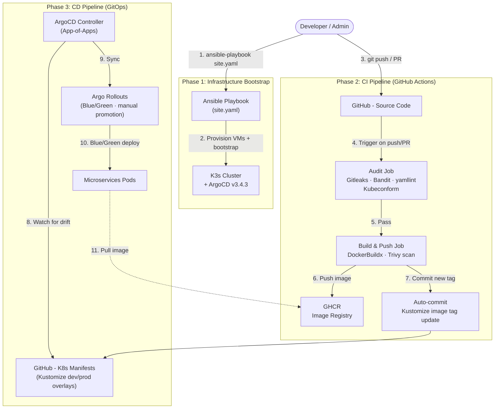

# ⚡ Proactive Autoscaling for Microservices on Kubernetes


## 📖 Project Overview

This project implements a **Proactive Autoscaling Platform** for microservices deployed on a K3s Kubernetes cluster. Unlike traditional reactive scaling (HPA) that responds *after* traffic spikes, this system uses an **AI-powered Prophet model** to **predict future traffic** and scale services *before* demand increases.

The entire platform is managed through **GitOps (ArgoCD)** and provisioned via **Ansible automation**, enabling full cluster bootstrap to a production-ready state with minimal manual actions required.

### Key Highlights
- **AI-Driven Proactive Scaling** — KEDA polls a FastAPI prediction endpoint to pre-scale services before traffic spikes occur
- **GitOps (ArgoCD App-of-Apps)** — Single bootstrap point for the entire infrastructure with automated synchronization. Kustomize manages `base`/`overlays` per environment: Prophet supports Dev/Prod, Boutique targets Production with Blue/Green
- **Zero-Downtime CD** — Blue/Green deployment strategy powered by Argo Rollouts
- **DevSecOps Pipeline** — GitHub Actions with Trivy vulnerability scanning, yamllint, kubeconform, Gitleaks, SAST and Flake8
- **Zero Plaintext Secrets** — Bitnami Sealed Secrets with automated certificate retrieval and encryption via Ansible
- **Full Observability & Alerting** — kube-prometheus-stack with custom Traefik RPS metrics, PrometheusRules, and automated Slack notifications for critical alerts

## 🏗️ Architecture



## 📂 Repository Structure

```text
├── .github/workflows/           # CI/CD GitHub Actions pipelines
├── apps/
│   ├── boutique/                # Google Online Boutique microservices (Kustomize)
│   └── prophet/                 # AI Scaler (FastAPI, CronJobs, MLflow, models)
├── infra/
│   ├── ansible/                 # K3s & ArgoCD cluster bootstrap automation
│   ├── argocd/                  # GitOps App-of-Apps definitions
│   ├── autoscaling/             # KEDA ScaledObjects rules
│   ├── ingress/                 # Traefik Ingress rules & ServiceMonitor for metrics
│   └── monitoring/              # Prometheus, Grafana, Alertmanager & Sealed Secrets configs
└── load-test/                   # K6 load testing scripts
```

## ⚙️ Quick Start — Full Cluster Bootstrap

### Prerequisites
- 2 Ubuntu VMs (Master: 4GB RAM, Worker: 8GB RAM) with SSH access
- Ansible installed on your control machine
- GitHub account with a PAT token for GHCR access
- Slack Webhook URL for Alertmanager

### 1. Configure Inventory

Edit `infra/ansible/inventories/production/hosts` with your VM IPs:
```ini
[master]
<MASTER_IP>

[worker]
<WORKER_IP>

[k3s_cluster:children]
master
worker
```

### 2. Run the Playbook

```bash
cd infra/ansible
ansible-playbook -i inventories/production/hosts site.yaml
```

The playbook will:
1. Install base packages (`curl`) on all nodes
2. Provision K3s control plane + install `kubeseal` CLI
3. Join worker node to the K3s cluster
4. Install ArgoCD + apply App-of-Apps manifest (which auto-deploys Helm charts: KEDA, Sealed Secrets, kube-prometheus-stack, Argo Rollouts)
5. Prompt for credentials → wait for ArgoCD to sync Sealed Secrets controller → encrypt and apply GHCR, Grafana, and Slack Webhook secrets → set ArgoCD admin password

### 3. Verify Deployment

```bash
# Check ArgoCD applications
k3s kubectl get applications -n argocd

# Check all pods
k3s kubectl get pods -A

# Access services (add to /etc/hosts)
# <MASTER_IP> web.local grafana.local argocd.local api.local mlflow.local rollouts.local
```

## 🤖 How Proactive Scaling Works

Unlike traditional reactive scaling (which responds *after* a spike), this system continuously forecasts future traffic and pre-scales services *before* demand arrives.



## 🗂️ AI Serving Infrastructure

The AI forecasting component is treated as **just another workload** on the cluster — packaged, deployed, and lifecycle-managed entirely through Kubernetes primitives and GitOps.



## 🔐 Security Design

| Layer | Implementation |
|-------|---------------|
| **Container Registry** | Sealed Secret (`ghcr_sealed.yaml`) — asymmetric encryption |
| **Grafana Admin** | Sealed Secret via Ansible `vars_prompt` — no plaintext in Git |
| **ArgoCD Admin** | bcrypt-hashed password via Ansible `vars_prompt` — patched at provision time |
| **Alertmanager Slack Webhook** | Sealed Secret via Ansible `vars_prompt` — automated routing |
| **Container Runtime** | Non-root user (UID 1000) + Pod `securityContext` |
| **Secret Detection** | Gitleaks scans all commits on PR — blocks credential leaks |
| **SAST** | Bandit scans Python source on every push — blocks insecure patterns |
| **Container Vulnerabilities** | Trivy blocks `CRITICAL`/`HIGH` CVEs before image is pushed |
| **Code Quality** | Flake8 (Python syntax) + yamllint + Kubeconform (K8s schemas) |

## 🔄 CI/CD Pipeline & GitOps Workflow

The full lifecycle is fully automated. The CI pipeline checks PRs and builds images on merge, updating Kustomize Overlays. ArgoCD then detects drift and applies changes using Blue/Green deployments for mission-critical services.



## 📊 Monitoring Access

| Service | URL | Credentials |
|---------|-----|-------------|
| Boutique Shop | `http://web.local` | — |
| Grafana | `http://grafana.local` | Set during playbook run |
| ArgoCD | `http://argocd.local` | `admin` / Set during playbook run |
| Argo Rollouts | `http://rollouts.local` | — |
| AI Forecast API | `http://api.local/api/forecast` | — |
| MLflow | `http://mlflow.local` | — |

## 🛠️ Tech Stack

| Category | Technology | Version |
|----------|-----------|--------|
| **Orchestration** | K3s (lightweight Kubernetes) | `v1.33.1+k3s1` |
| **GitOps / CD** | ArgoCD (App-of-Apps pattern) | `v3.4.3` |
| **Progressive Delivery** | Argo Rollouts (Blue/Green) | `2.41.0` |
| **Autoscaling** | KEDA (metrics-api + CPU triggers) | `2.18.0` |
| **AI/ML** | Facebook Prophet, MLflow, FastAPI | `1.3.0`, `3.12.0`, `0.115.x` |
| **CI Pipeline** | GitHub Actions, Docker Buildx, Trivy, Bandit, Gitleaks | — |
| **Manifest Management** | Kustomize (base/overlays), Kubeconform | — |
| **Monitoring & Alerting** | kube-prometheus-stack (Prometheus, Grafana, Alertmanager + Slack) | `75.12.0` |
| **Secret Management** | Bitnami Sealed Secrets | `2.18.6` |
| **IaC / Provisioning** | Ansible | — |
| **Ingress** | Traefik (K3s built-in) | — |
| **Load Testing** | K6 | — |

## 📝 Known Limitations

- **No TLS:** `.local` domains use HTTP only (cert-manager + Let's Encrypt would be the production path)
- **No NetworkPolicy:** All pods can communicate freely within the cluster namespace
- **Frozen MLOps Loop:** The Retrain CronJob demonstrates the MLOps architecture end-to-end, but the AI Server deliberately uses a frozen pre-trained model. The load generator (Boutique's synthetic traffic) lacks real-world seasonality and sufficient volume to produce a model that improves on retraining — this is a known data constraint of the lab environment, not a gap in the pipeline design.
- **Static `.local` DNS:** Requires a manual `/etc/hosts` entry on the client machine; a proper DNS resolver (e.g., CoreDNS external or a wildcard entry) would remove this step.

---

*This project was developed as a Major Project (Đồ án chuyên ngành) at UIT, focusing on modern DevOps Engineering practices — proactive AI-driven scaling, GitOps, DevSecOps, and observability abilities.*
