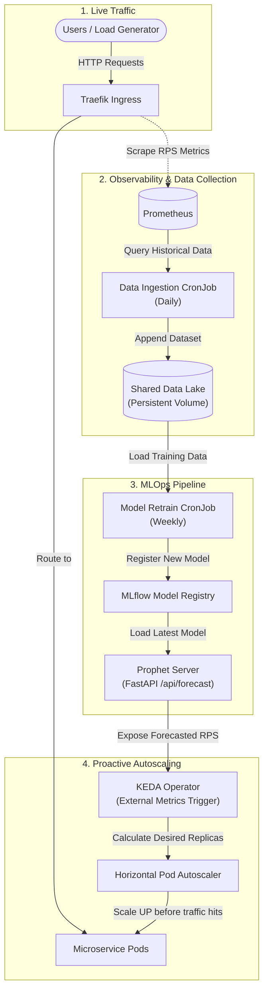
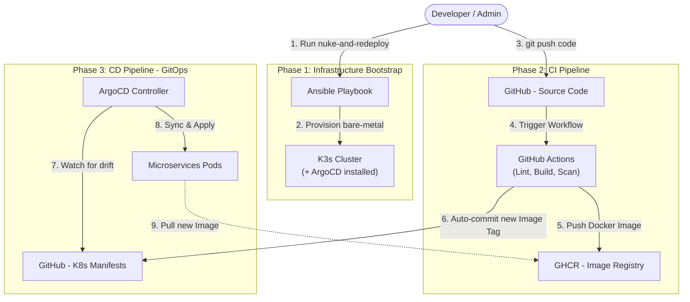

# ⚡ Proactive Autoscaling for Microservices on Kubernetes


## 📖 Project Overview

This project implements a **Proactive Autoscaling Platform** for microservices deployed on a K3s Kubernetes cluster. Unlike traditional reactive scaling (HPA) that responds *after* traffic spikes, this system uses an **AI-powered Prophet model** to **predict future traffic** and scale services *before* demand increases.

The entire platform is managed through **GitOps (ArgoCD)** and provisioned via **Ansible automation**, enabling full cluster bootstrap from bare metal to a production-ready state in a single command.

### Key Highlights
- **AI-Driven Proactive Scaling** — KEDA polls a FastAPI prediction endpoint to pre-scale services before traffic spikes occur
- **GitOps (ArgoCD App-of-Apps)** — Single bootstrap point for the entire infrastructure with automated synchronization
- **DevSecOps Pipeline** — GitHub Actions with Trivy vulnerability scanning, yamllint, kubeconform, and Flake8
- **Zero Plaintext Secrets** — Bitnami Sealed Secrets with automated certificate retrieval and encryption via Ansible
- **Full Observability** — kube-prometheus-stack with custom Traefik ServiceMonitor for RPS metrics

## 🏗️ Architecture


## 📂 Repository Structure

```text
├── .github/workflows/
│   ├── ci-ai-scaler.yaml       # CI: Build → Trivy Scan → Push → Update Tag
│   └── audit-ci.yaml           # Audit: yamllint + Flake8 + Kubeconform
├── apps/
│   ├── boutique/
│   │   └── google_boutique.yaml # Google Online Boutique microservices (8 services)
│   └── prophet/
│       ├── Dockerfile           # Non-root Python container
│       ├── ai_server.py         # FastAPI prediction endpoint (/api/forecast)
│       ├── data_ingestion.py    # Daily Prometheus → CSV data pipeline
│       ├── model_retrain.py     # Weekly sliding window retraining
│       ├── requirements.txt     # Pinned Python dependencies
│       ├── ai-scaler-architecture.yaml  # CronJobs + Deployment + Service
│       ├── ai-configmap.yaml    # Environment configuration
│       ├── mlflow-server.yaml   # MLflow Tracking Server
│       ├── ghcr_sealed.yaml     # Encrypted GHCR registry credentials
│       ├── data/                # Mock datasets for Prophet training
│       └── prophet_model/       # Baked-in Prophet model artifact
├── infra/
│   ├── ansible/
│   │   ├── playbook.yaml        # End-to-end cluster provisioning (5 steps)
│   │   ├── hosts.ini            # Inventory (master + worker)
│   │   └── ansible.cfg
│   ├── argocd/
│   │   ├── argocd-app.yaml      # App-of-Apps root application
│   │   ├── boutique-app.yaml    # Boutique microservices (with ignoreDifferences)
│   │   ├── prophet-app.yaml     # AI scaler components
│   │   ├── monitoring-app.yaml  # kube-prometheus-stack (Helm)
│   │   ├── keda-app.yaml        # KEDA ScaledObjects
│   │   ├── ingress-app.yaml     # Traefik Ingress rules
│   │   └── sealed-secrets-app.yaml  # Sealed Secrets controller (Helm)
│   ├── autoscaling/
│   │   └── keda_hpa.yaml        # 8 ScaledObjects (1 proactive + 7 reactive)
│   ├── monitoring/
│   │   ├── values.yaml          # Grafana + Prometheus custom values
│   │   └── grafana-sealed.yaml  # Encrypted Grafana admin credentials
│   └── ingress/
│       ├── boutique-ingress.yaml       # web.local, api.local, mlflow.local
│       ├── monitoring-ingress.yaml     # grafana.local
│       ├── argocd-ingress.yaml         # argocd.local
│       └── traefik-metrics-config.yaml # ServiceMonitor for Traefik RPS
└── load-test/
    └── quick_test.py            # Locust load testing script
```

## ⚙️ Quick Start — Full Cluster Bootstrap

### Prerequisites
- 2 Ubuntu VMs (Master: 8GB RAM, Worker: 2GB RAM) with SSH access
- Ansible installed on your control machine
- GitHub account with a PAT token for GHCR access

### 1. Configure Inventory

Edit `infra/ansible/hosts.ini` with your VM IPs:
```ini
[master]
<MASTER_IP> ansible_user=<USER> ansible_ssh_private_key_file=~/.ssh/id_rsa

[worker]
<WORKER_IP> ansible_user=<USER> ansible_ssh_private_key_file=~/.ssh/id_rsa
```

### 2. Run the Playbook

```bash
cd infra/ansible
ansible-playbook playbook.yaml
```

The playbook will:
1. Install base packages (curl) on all nodes
2. Provision K3s control plane + install `kubeseal` CLI
3. Join worker node to the cluster
4. Install KEDA + ArgoCD + apply App-of-Apps manifest
5. Prompt for credentials → wait for ArgoCD to sync Sealed Secrets → encrypt and apply GHCR & Grafana secrets → set ArgoCD admin password

> **Note:** Step 5 polls for the `sealed-secrets-controller` deployment in `kube-system` with a 10-minute timeout before proceeding to allow ArgoCD enough time to sync. Sensitive values are protected with `no_log: true` during execution.

### 3. Verify Deployment

```bash
# Check ArgoCD applications
k3s kubectl get applications -n argocd

# Check all pods
k3s kubectl get pods -A

# Verify sealed-secrets controller is running
k3s kubectl get deployment sealed-secrets-controller -n kube-system

# Access services (add to /etc/hosts)
# <MASTER_IP> web.local grafana.local argocd.local api.local mlflow.local
```

## 🤖 How Proactive Scaling Works

Unlike traditional reactive scaling (which responds *after* a spike), this system continuously forecasts future traffic and pre-scales services *before* demand arrives.



> **Design Decision:** The AI server uses a fixed model trained on synthetic (mock) data for demo stability. The retrain pipeline exists to demonstrate the complete MLOps architecture, but real Prometheus data lacks sufficient seasonality for accurate predictions in a lab environment.

## 🔐 Security Design

| Layer | Implementation |
|-------|---------------|
| **Container Registry** | Sealed Secret (`ghcr_sealed.yaml`) — asymmetric encryption |
| **Grafana Admin** | Sealed Secret via Ansible `vars_prompt` — no plaintext in Git |
| **ArgoCD Admin** | bcrypt-hashed password via Ansible `vars_prompt` — patched at provision time |
| **Container Runtime** | Non-root user (UID 1000) + Pod `securityContext` |
| **CI Pipeline** | Trivy scan blocks CRITICAL/HIGH vulnerabilities |
| **Code Quality** | Flake8 (Python) + yamllint (YAML) + Kubeconform (K8s schemas) |

## 🔄 CI/CD Pipeline & GitOps Workflow

The full lifecycle — from a developer pushing code to pods rolling out — is fully automated and auditable through Git.



## 📊 Monitoring Access

| Service | URL | Credentials |
|---------|-----|-------------|
| Boutique Shop | `http://web.local` | — |
| Grafana | `http://grafana.local` | Set during playbook run |
| ArgoCD | `http://argocd.local` | `admin` / Set during playbook run |
| AI Forecast API | `http://api.local/api/forecast` | — |
| MLflow | `http://mlflow.local` | — |

## 🛠️ Tech Stack

| Category | Technology |
|----------|-----------|
| **Orchestration** | K3s (lightweight Kubernetes) |
| **GitOps** | ArgoCD (App-of-Apps pattern) |
| **Autoscaling** | KEDA (metrics-api + CPU triggers) |
| **AI/ML** | Facebook Prophet, MLflow, FastAPI |
| **CI/CD** | GitHub Actions, Docker Buildx, Trivy |
| **Monitoring** | Prometheus, Grafana, Traefik ServiceMonitor |
| **Security** | Bitnami Sealed Secrets, kubeseal |
| **IaC** | Ansible |
| **Ingress** | Traefik (K3s default) |
| **Load Testing** | Locust |

## 📝 Known Limitations

- **Single-environment:** No dev/staging separation (lab scope)
- **No TLS:** `.local` domains use HTTP only (would use cert-manager + Let's Encrypt in production)
- **No alerting rules:** Prometheus collects metrics but no PrometheusRule CRDs for alerts
- **No NetworkPolicy:** All pods can communicate freely within the cluster
- **Fixed AI model:** Production would implement automated model promotion from MLflow

---

*This project was developed as a Major Project (Đồ án chuyên ngành) focusing on DevOps Engineering practices.*
